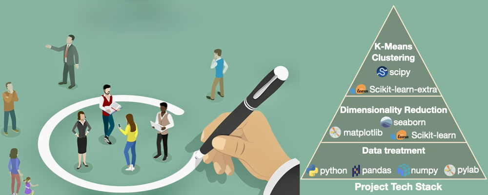

# 📈 Unsupervised Learning on Marketing Campaign Data: PCA, t-SNE, and K-Means Clustering
This project applies t-SNE, dimensionality reduction (PCA), and clustering (K-means) to analyze customer profiles and perform segmentation.


## 📂 Table of Contents
- [Overview](#-overview)
- [Dataset](#-dataset)
- [Problem Statement](#-problem-statement)
- [Methodology](#-methodology)
- [Results](#-results)
- [Final recommendations and conclusions](#-Final-recommendations-and-conclusions)
- [Technologies Used](#technologies-used)
- [How to Run](#how-to-run)

## 🧠 Overview
This project implements an unsupervised learning pipeline to reduce the dimensionality of customer profile data, classify customers based on their profiles, and evaluate both business strategy and customer engagement approaches.

## 📊 Dataset
This dataset was originally provided as part of the *Applied Data Science Program* by MIT. The dataset is a **2240 × 27** CSV file, where each row represents a customer's profile.

Each record includes **27 variables** describing customer information and purchase record.

Detailed feature descriptions are listed in the table below:
| Feature             | Description                                                                                   |
|---------------------|-----------------------------------------------------------------------------------------------|
| `ID`                | Unique ID of each customer                                                                    |
| `Year_Birth`        | Customer’s year of birth                                                                      |
| `Education`         | Customer's level of education                                                                 |
| `Marital_Status`    | Customer's marital status                                                                     |
| `Kidhome`           | Number of small children in customer's household                                              |
| `Teenhome`          | Number of teenagers in customer's household                                                   |
| `Income`            | Customer's yearly household income in USD                                                     |
| `Recency`           | Number of days since the last purchase                                                        |
| `Dt_Customer`       | Date of customer's enrollment with the company                                                |
| `MntFishProducts`   | The amount spent on fish products in the last 2 years                                         |
| `MntMeatProducts`   | The amount spent on meat products in the last 2 years                                         |
| `MntFruits`         | The amount spent on fruits products in the last 2 years                                       |
| `MntSweetProducts`  | Amount spent on sweet products in the last 2 years                                            |
| `MntWines`          | The amount spent on wine products in the last 2 years                                         |
| `MntGoldProds`      | The amount spent on gold products in the last 2 years                                         |
| `NumDealsPurchases` | Number of purchases made with discount                                                        |
| `NumCatalogPurchases` | Number of purchases made using a catalog (buying goods to be shipped through the mail)     |
| `NumStorePurchases` | Number of purchases made directly in stores                                                   |
| `NumWebPurchases`   | Number of purchases made through the company's website                                        |
| `NumWebVisitsMonth` | Number of visits to the company's website in the last month                                   |
| `AcceptedCmp1`      | 1 if customer accepted the offer in the first campaign, 0 otherwise                           |
| `AcceptedCmp2`      | 1 if customer accepted the offer in the second campaign, 0 otherwise                          |
| `AcceptedCmp3`      | 1 if customer accepted the offer in the third campaign, 0 otherwise                           |
| `AcceptedCmp4`      | 1 if customer accepted the offer in the fourth campaign, 0 otherwise                          |
| `AcceptedCmp5`      | 1 if customer accepted the offer in the fifth campaign, 0 otherwise                           |
| `Response`          | 1 if customer accepted the offer in the last campaign, 0 otherwise                            |
| `Complain`          | 1 if the customer complained in the last 2 years, 0 otherwise                                 |

## ❓ Problem Statement
Marketing campaigns play a crucial role in attracting new customers and driving business growth. In turn, a growing business requires ongoing marketing efforts to maintain and expand its customer base. However, ineffective campaigns often stem from an insufficient understanding of the customer population—frequently due to poorly defined or missing customer segments. Misguided marketing efforts not only fail to retain existing customers but may also discourage potential new ones. An effective customer segmentation strategy can address this challenge, supported by a strong foundation of rich, well-organized customer profile and behavioral data.

## 🔎 Methodology
The following steps outline the end-to-end process used in this project:

1. **Data Overview**  
   The marketing campaign dataset was loaded into a pandas DataFrame for initial inspection. Key characteristics—such as dataset dimensions, data types, presence of duplicates or null values, and the number of unique values per feature—were examined.

2. **Exploratory Data Analysis (EDA)**  
   - **Univariate analysis** was conducted to examine the distribution of individual features using histograms and descriptive statistics.  
   - **Bivariate analysis** explored relationships between pairs of variables. Scatter plots and correlation heatmaps were used to visualize associations between numerical and categorical features.

3. **Feature Engineering and Data Processing**  
   - Missing values were imputed using the median.  
   - New features were engineered based on existing data to reveal hidden patterns.  
   - Additional bivariate analysis was performed on the engineered features.

4. **Scaling and Dimensionality Reduction (PCA / t-SNE)**  
   - The dataset was scaled and normalized.  
   - t-SNE was applied to visualize potential customer segments.  
   - PCA was used to reduce the dataset’s dimensionality while preserving variance.

5. **K-Means Clustering and Customer Profiling**  
   - K-Means clustering was applied to identify distinct customer segments.  
   - Customer profiles were created by analyzing the characteristics of each cluster.

## 🏁 Results


**Summary of each cluster:**
- Cluster 0 represents customers with higher income, higher expenses, more purchases, more campaign acceptance, and relatively longer engagement days. Those customers take 58% of the total customer base. They are identified as major customers.
- Cluster 1 represents customers with more web visits. Notably, their expenses, purchases, and campaign acceptance are significantly lower. Those customers take 42% of the total customer base, which is still considered significant for the business. They are identified as online customers who look for non-daily products, possibly waiting for deals.

**Recommendation of each cluster:**
- Keep the current marketing strategy with cluster 0 customers.
- Do deep profile study for cluster 1 customers. Run special deals on both daily expenses for them if possible. Investigate their spending on non-daily products, such as electronics. Run special deals on those products as well.

## 💡 Final recommendations and conclusions

**Action items for stakeholders**
- More detailed customer profile collection. Future customer data should include information such as their distance from the store. This will help interpret why cluster 1 are online shoppers.
- More product information should be collected. Future observation should include products and their purchase such as electronics. This will give us more clue about why cluster 1 are seeking deal and what they expect from the deals.
- Provide deliver services for online shoppers, and more sales for deal seekers.
- Maintain the existing customer base with cluster 0. No change is needed by keep observing the customer base size change and spending distribution shift.

**Benefits and risk analysis**
- Increase customer base by providing more services.
- Potentially lose revenue by giving discounts and delivery services.
- In order to minimize the risk, more comprehensive data collection should be built first. This gives more insights about whether cluster 1 customers will buy more discounted products, and whether they do web visits because of inconvenience to drive.

<a id="technologies-used"></a>
## ⚙️ Technologies Used
- **Python** – General-purpose programming language used for data analysis and machine learning workflows  
- **Pandas** – Data manipulation and analysis using DataFrames and Series  
- **NumPy** – Efficient numerical computations and array operations  
- **Matplotlib & Seaborn** – Visualization libraries used for generating plots and statistical graphics  
- **Scikit-learn** – Machine learning library used for dimensionality reduction (`PCA`, `t-SNE`), clustering (`KMeans`, `DBSCAN`, `AgglomerativeClustering`), preprocessing (`StandardScaler`), and evaluation (`silhouette_score`)  
- **Scikit-learn-extra** – Provides additional machine learning algorithms, notably `KMedoids` clustering  
- **SciPy** – Scientific computing library used for hierarchical clustering methods (`linkage`, `cophenet`) and distance computations (`pdist`)  
- **Pylab** – Simplified interface combining Matplotlib and NumPy, used for quick numerical plotting (`matplotlib.pylab`)  
- **Warnings** – Used to suppress non-critical warning messages to ensure clean notebook output

<a id="how-to-run"></a>
## ▶️ How to Run
```bash
# Clone the repository
git clone https://github.com/elescj/001-marketing-campaign-lr.git
cd 001-marketing-campaign-lr

# (Optional) Create a virtual environment
python -m venv venv
source venv/bin/activate  # On Windows: venv\Scripts\activate

# Install dependencies
pip install -r requirements.txt

# Run the script
python main.py
```
