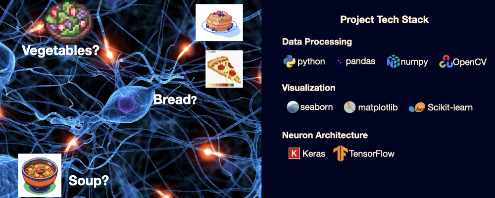

# 🍲 Food Image Classification Using CNN
This project applies Convolutional Neural Network (CNN) models to classify food images into their respective categories, with the objective of developing the most accurate and reliable CNN architecture for food recognition.


## 📂 Table of Contents
- [Overview](#-overview)
- [Dataset](#-dataset)
- [Problem Statement](#-problem-statement)
- [Methodology](#-methodology)
- [Results](#-results)
- [Insights & Recommendations](#-insights--recommendations)
- [Technologies Used](#technologies-used)
- [How to Run](#how-to-run)

## 👓 Overview
This project implements a **deep learning pipeline** for **classifying food images** into their respective categories. Using **Convolutional Neural Networks (CNNs)**, the model learns visual patterns that capture the unique characteristics of each food type, allowing it to accurately classify previously unseen (unlabeled) images.

The pipeline includes:
- **Data preprocessing and image handling**
- **Design and implementation of two CNN architectures**
- **Model training, evaluation, and performance comparison**
- **Demonstration of the best-performing model on sample images**

## 📊 Dataset

The dataset for this project is sourced from the **MIT Applied Data Science Program** and is organized as follows:

- The dataset is provided in **ZIP format**, containing **training** and **test** folders.
- Each folder has **three subfolders**, each representing a **food category**.
- All images are in **JPG format**.

> **Note:** The original dataset exceeds GitHub's upload limit.  
> To access the data, please contact me via my portfolio website:  
> [Contact Charles Jiao](https://charles-jiao.netlify.app/contact)


## ❓ Problem Statement
Classifying food categories from images is important for applications such as automated dietary tracking, restaurant menu organization, and food recommendation systems. It’s a challenging problem because food images can vary widely in appearance due to differences in presentation, lighting, angle, and portion size. In this project, we use a labeled dataset of food images to build convolutional neural network (CNN) models that classify images into their respective food categories, providing practical insights into visual recognition of foods.

## 💻 Methodology
The following steps outline the end-to-end process used in this project:

1. **Data (image) processing**
   - **Data Overview**: Examined the dataset to understand variable types, identify duplicates, and assess missing values.
   - **Initial Data Treatment**: Cleaned and structured the dataset to ensure readiness for exploratory data analysis (EDA).

2. **Modelling**
   - Trained **Logistic Regression**, **Decision Tree**, and **Random Forest** models separately to forecast customer conversion.
   - Tuned **hyperparameters** to improve predictive performance and mitigate overfitting.
   - Evaluated model performance using relevant metrics and visualized the tuned results.

## 📝 Results

The models were evaluated on both **training** and **test** datasets using standard classification metrics.  

- **Precision (1)**: When the model predicts a conversion, how often it is correct.  
- **Recall (1)**: Out of all actual conversions, how many were correctly identified.  
- **F1-Score (1)**: Balance between precision and recall.  
- **Accuracy**: Overall correct predictions (can be misleading if classes are imbalanced).  

| Model                 | Dataset  | Class | Precision | Recall | F1-Score | Support | Accuracy | Macro Avg (F1) | Weighted Avg (F1) |
| --------------------- | -------- | ----- | --------- | ------ | -------- | ------- | -------- | -------------- | ----------------- |
| Logistic Regression   | Training | 0     | 0.85      | 0.96   | 0.90     | 3355    | 0.83     | 0.66           | 0.81              |
| Logistic Regression   | Training | 1     | 0.66      | 0.30   | 0.42     | 817     |          |                |                   |
| Logistic Regression   | Test     | 0     | 0.83      | 0.97   | 0.90     | 1416    | 0.82     | 0.64           | 0.79              |
| Logistic Regression   | Test     | 1     | 0.69      | 0.27   | 0.39     | 372     |          |                |                   |
| Decision Tree (tuned) | Training | 0     | 0.94      | 0.90   | 0.92     | 3355    | 0.87     | 0.81           | 0.88              |
| Decision Tree (tuned) | Training | 1     | 0.65      | 0.76   | 0.70     | 817     |          |                |                   |
| Decision Tree (tuned) | Test     | 0     | 0.93      | 0.90   | 0.91     | 1416    | 0.87     | 0.80           | 0.87              |
| Decision Tree (tuned) | Test     | 1     | 0.66      | 0.73   | 0.69     | 372     |          |                |                   |
| Random Forest (tuned) | Training | 0     | 0.94      | 0.89   | 0.92     | 3355    | 0.87     | 0.81           | 0.88              |
| Random Forest (tuned) | Training | 1     | 0.63      | 0.77   | 0.70     | 817     |          |                |                   |
| Random Forest (tuned) | Test     | 0     | 0.92      | 0.90   | 0.91     | 1416    | 0.86     | 0.80           | 0.86              |
| Random Forest (tuned) | Test     | 1     | 0.65      | 0.72   | 0.68     | 372     |          |                |                   |

## 💡 Insights & Recommendations

### 🔎 Insights
#### Best Performing Model
- The **Tuned Decision Tree** and **Random Forest** showed the best trade-off between test accuracy and recall for defaulters.  
- **Logistic Regression**, while simpler, underperformed in identifying defaults due to low recall for class 1.  

#### Feature Insights
- **Debt-to-income ratio (DEBTINC)** and its missing value flag were the most critical features, emphasizing financial stability as the key factor for defaults.  
- **Age of credit history (CLAGE)** and **property value (VALUE)** also contributed significantly.  
- Categorical features like **REASON** and **JOB** had minor effects after encoding.  

#### Overfitting Considerations
- Untuned **Decision Trees** and **Random Forests** overfit the training data completely (*F1-score = 1.0*), highlighting the importance of hyperparameter tuning.  
- **Grid search tuning** improved test set generalization, balancing precision and recall.  

### ✅ Recommendations
#### Model Selection
- Use **Tuned Decision Tree** or **Random Forest** for deployment to predict defaults, as they offer the best combination of recall for defaulters and overall accuracy.  

#### Feature Monitoring
- Monitor critical features like **DEBTINC** and **CLAGE** in real-time to ensure model stability.  
- Regularly update **missing value flags** to reflect changes in data collection.  

#### Future Work
- Explore ensemble techniques like **Gradient Boosting** or **XGBoost** for potentially higher predictive power.  
- Incorporate more **demographic and behavioral features** if available to improve recall for high-risk borrowers.  
- Implement **cost-sensitive learning** or **resampling strategies** to address class imbalance and reduce false negatives for defaulters.  

<a id="technologies-used"></a>
## ⚙️ Technologies Used
- **Python** – General purpose programming
- **Pandas** – Data manipulation and analysis
- **NumPy** – Numerical computations
- **Matplotlib & Seaborn** – Data visualization
- **Scikit-learn** – Model training and evaluation
- **Statsmodels** – Statistical modeling (OLS regression, VIF)
- **SciPy** – Statistical tests and probability distributions
- **Warnings** – For suppressing non-critical output

<a id="how-to-run"></a>
## ▶️ How to Run
```bash
# Clone the repository
git clone https://github.com/elescj/006-loan-lr.git
cd 006-loan-lr

# (Optional) Create a virtual environment
python -m venv venv
source venv/bin/activate  # On Windows: venv\Scripts\activate

# Install dependencies
pip install -r requirements.txt

# Run the script
python main.py
```
