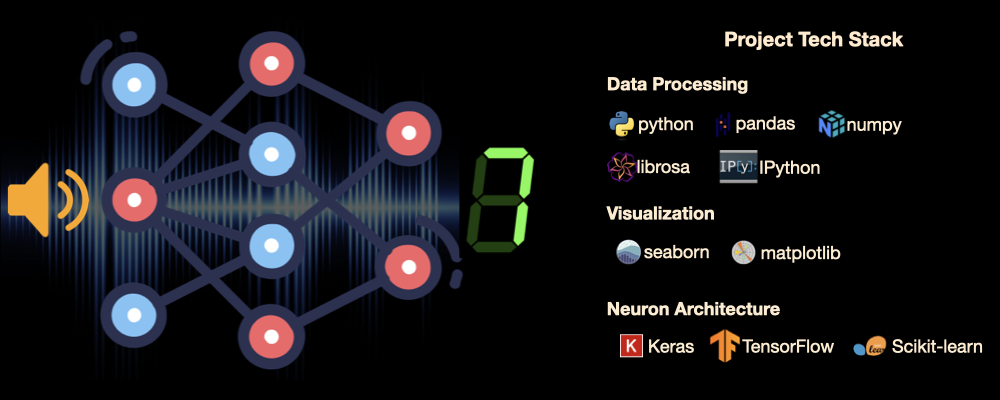

# 🔊Audio MNIST Digit Recognition
This project applies an Artificial Neural Network (ANN) to classify spoken digits (0–9) from audio recordings. The objective is to develop a highly accurate and reliable neural network architecture for audio-based digit recognition.


## 📂 Table of Contents
- [Overview](#-overview)
- [Dataset](#-dataset)
- [Problem Statement](#-problem-statement)
- [Methodology](#-methodology)
- [Results](#-results)
- [Insights & Recommendations](#-insights--recommendations)
- [Technologies Used](#technologies-used)
- [How to Run](#how-to-run)

## 👓 Overview
This project implements a **deep learning pipeline** for **classifying spoken digits from audio recordings** into their respective categories (0–9). Using **Artificial Neural Networks (ANNs)**, the model learns distinctive numerical patterns from processed audio features, enabling it to accurately classify previously unheard (unlabeled) audio samples.

The pipeline includes:
- **Audio sampling and data processing**
- **Modelling and ANN architecture**
- **Model training and evaluationn**

## 📊 Dataset

The dataset used in this project is sourced from the MIT Applied Data Science Program. It consists of audio recordings of spoken digits, organized into separate folders for each class (0–9).

Each folder contains multiple `.wav` files, where each file represents a spoken instance of the corresponding digit. These audio samples serve as the input data for training and evaluating the model.

> **Note:** The original dataset exceeds GitHub's upload limit.  
> To access the data, please contact me via my portfolio website:  
> [Contact Charles Jiao](https://charles-jiao.netlify.app/contact)


## ❓ Problem Statement
Despite major advancements in audio recognition, one of the key challenges remains efficiently transforming and interpreting raw audio data for accurate classification.  
Raw audio waveforms contain vast amounts of data, making them computationally expensive and difficult for neural networks to process directly. To overcome this, the use of spectrogram-based representations—particularly **Mel-Frequency Cepstral Coefficients (MFCCs)**—has become a preferred approach due to their ability to compactly capture the essential frequency and temporal characteristics of sound.

The goal of this project is to develop an **Artificial Neural Network (ANN)** capable of accurately classifying spoken digits (0–9) based on their corresponding MFCC spectrograms.  
Each input audio sample represents a short recording of a speaker pronouncing a single digit, and the model is trained to learn distinguishing frequency patterns that correspond to each number.  

By doing so, this project demonstrates how deep learning models can effectively “hear” and recognize audio content through numerical pattern recognition, bridging the gap between sound and structured machine understanding.

## 💻 Methodology

The following steps outline the end-to-end process used in this project:

### 1. **Data (Audio) Processing**
- **Data Retrieval and Preparation**:  
  Extract all `.wav` audio files from the dataset folders and organize them into training and testing sets. Each folder corresponds to one of the 10 digit classes (0–9).  
- **Data Visualization**:  
  Randomly select several audio samples to visualize their waveform and spectrogram representations, identifying patterns that may be useful for classification.  
- **Feature Extraction (MFCCs)**:  
  Convert each audio signal into **Mel-Frequency Cepstral Coefficients (MFCCs)** — a compact numerical representation that captures both frequency and temporal characteristics of sound. These MFCC features serve as the input to the neural network.

### 2. **Modeling**
- **Model Design**:  
  Construct an **Artificial Neural Network (ANN)** with multiple dense layers. The model is designed to learn non-linear relationships between MFCC features and their corresponding digit labels.  
- **Model Training**:  
  Train the ANN on the processed dataset, using a validation split to monitor performance and prevent overfitting.  
- **Model Evaluation**:  
  Evaluate the trained model on unseen test data using metrics such as accuracy, precision, recall, and F1-score to assess its classification performance.

## 📝 Results

The models were evaluated on **test** datasets using standard classification metrics.  

- **Precision (1)**: When the model predicts a conversion, how often it is correct.  
- **Recall (1)**: Out of all actual conversions, how many were correctly identified.  
- **F1-Score (1)**: Balance between precision and recall.  
- **Accuracy**: Overall correct predictions (can be misleading if classes are imbalanced).  

**Classification Report**

| Class | Precision | Recall | F1-Score | Support |
|-------|----------|--------|----------|---------|
| 0     | 1.00     | 0.98   | 0.99     | 124     |
| 1     | 0.99     | 0.99   | 0.99     | 123     |
| 2     | 0.99     | 0.99   | 0.99     | 115     |
| 3     | 0.99     | 1.00   | 1.00     | 121     |
| 4     | 0.99     | 1.00   | 1.00     | 136     |
| 5     | 1.00     | 1.00   | 1.00     | 126     |
| 6     | 1.00     | 1.00   | 1.00     | 127     |
| 7     | 0.99     | 1.00   | 1.00     | 121     |
| 8     | 1.00     | 1.00   | 1.00     | 129     |
| 9     | 1.00     | 0.99   | 1.00     | 128     |

**Accuracy:** 1.00  
**Macro Avg:** Precision: 1.00, Recall: 1.00, F1-Score: 1.00  
**Weighted Avg:** Precision: 1.00, Recall: 1.00, F1-Score: 1.00

## 💡 Insights & Recommendations

### 🔎 Insights
In this project, we built a Convolutional Neural Network (CNN) to classify food images into three categories: **Bread**, **Soup**, and **Vegetable-Fruit**.  

The model achieved an overall test accuracy of **66%**, with class-wise performance varying significantly:

- **Vegetable-Fruit**: Strong performance (F1-score 0.82), correctly classified most images.  
- **Soup**: Moderate performance (F1-score 0.72) with high recall (0.90), indicating most Soup images were correctly identified.  
- **Bread**: Weak performance (F1-score 0.35), frequently misclassified as Soup, showing challenges in distinguishing visually similar categories.  

Confusion matrix analysis confirmed that the model struggles most with **Bread vs. Soup** due to overlapping visual features or possible dataset imbalance.  

Overall, the model demonstrates moderate capability in classifying food images, performing better on distinct classes (**Vegetable-Fruit**) than on similar ones (**Bread** and **Soup**).

### ✅ Recommendations
1. **Increase Data Variety and Augmentation**  
   - Add more Bread images or apply data augmentation (rotation, flipping, scaling) to reduce misclassification.

2. **Address Class Imbalance**  
   - Use class weighting or oversampling techniques to give the model more emphasis on underrepresented classes.

3. **Use Transfer Learning**  
   - Pre-trained models like **VGG16**, **ResNet**, or **EfficientNet** could improve feature extraction, especially for visually similar classes.

4. **Hyperparameter Tuning**  
   - Experiment with different architectures, optimizers, learning rates, batch sizes, and dropout rates to improve generalization.

5. **Additional Evaluation Metrics**  
   - Consider precision-recall curves, ROC-AUC, or top-2 accuracy to better understand model performance on ambiguous cases.

6. **Deployment Considerations**  
   - For real-world use in a stock photography platform, implement a **human-in-the-loop verification** for low-confidence predictions to ensure labeling quality.

<a id="technologies-used"></a>
## ⚙️ Technologies Used
- **Python** – General purpose programming
- **NumPy** – Numerical computations
- **Pandas** – Data manipulation and analysis
- **OpenCV** – Image processing and augmentation
- **Matplotlib & Seaborn** – Data and performance visualization
- **Scikit-learn** – Data preprocessing, model evaluation, and metrics
- **TensorFlow & Keras** – Building, training, and deploying Convolutional Neural Networks (CNN)
- **Warnings** – For suppressing non-critical output

<a id="how-to-run"></a>
## ▶️ How to Run
```bash
# Clone the repository
git clone https://github.com/elescj/007-food-picture-lr.git
cd 007-food-image-lr

# (Optional) Create a virtual environment
python -m venv venv
source venv/bin/activate  # On Windows: venv\Scripts\activate

# Install dependencies
pip install -r requirements.txt

# Run the script
python main.py
```

