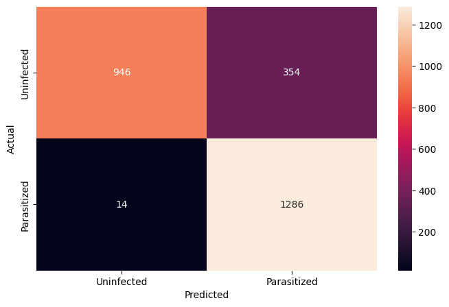

# 🦟 Automated Malaria Detection Using CNNs and Transfer Learning
This project builds and compares four convolutional neural net work (CNN) models to classify blood cell (uninfected/ parasitized) using microscopic images. Transfer learning is then applied to make predictions (pre-trained VGG16 model) on unseen images, demonstrating the effectiveness of CNNs for real-world computer vision.


## 📂 Table of Contents
- [Overview](#-overview)
- [Dataset](#-dataset)
- [Problem Statement](#-problem-statement)
- [Methodology](#-methodology)
- [Results](#-results)
- [Insights & Recommendations](#-insights--recommendations)
- [Technologies Used](#technologies-used)
- [How to Run](#how-to-run)

## 👓 Overview
This project implements a **deep learning pipeline** to **classify blood cell (uninfected/ parasitized) using microscopic images** using **Convolutional Neural Networks (CNNs)**. The model learns visual patterns that capture the unique characteristics of each image, enabling accurate classification of previously unseen (unlabeled) images.

The pipeline includes:
- **Data preprocessing and image handling**
- **Design and implementation of four CNN architectures**
- **Model training, evaluation, and performance comparison**
- **Transfer learning using the pre-trained VGG16 model and model evaluation**

## 📊 Dataset

The dataset for this project is sourced from the **MIT Applied Data Science Program** and is organized as follows:

- The dataset is provided in **ZIP format**, containing **training** and **test** folders.
- Each folder has **two subfolders**, each representing a **health condition of the cell**.
- All images are in **PNG format**.

> **Note:** The original dataset exceeds GitHub's upload limit.  
> To access the data, please contact me via my portfolio website:  
> [Contact Charles Jiao](https://charles-jiao.netlify.app/contact)

## ❓ Problem Statement
Classifying images is essential in computer vision, automation, and robotics, it remains challenging in fields such as public health where high accuracy makes great significance. In this project, I used the microscopic images to develop CNN-based classification models capable of accurately identifying blood cell images. The project produces a trained deep learning model along with a full training-evaluation pipeline that supports downstream prediction tasks.

## 💻 Methodology
The following steps outline the end-to-end process used in this project:

1. **Data (image) Processing**
   - **Data Retrieval and Preparation**: Extract data from the ZIP file and prepare the training and test data.
   - **Data Visualization**: Randomly choose a few images and observe their potential features that may be extracted in CNN.
   - **Data Preprocessing**: Label the data, split into training and test set, normalize the images, and encode the categories.

2. **Modelling**
   - Build two models with different neuron structures for comparison.
   - For each model, build the architecture, training this model, and evaluate the model accuracy and confusion matrix.
   - Run a prediction with the better model.

## 📝 Results

The second model were evaluated on **test** datasets using standard classification metrics.  

- **Precision (1)**: When the model predicts a conversion, how often it is correct.  
- **Recall (1)**: Out of all actual conversions, how many were correctly identified.  
- **F1-Score (1)**: Balance between precision and recall.  
- **Accuracy**: Overall correct predictions (can be misleading if classes are imbalanced).  

**Classification Report**

| Class | Precision | Recall | F1-Score | Support |
|-------|----------|--------|----------|----------|
| 0     | 0.84     | 0.78   | 0.81     | 1814     |
| 1     | 0.73     | 0.83   | 0.78     | 1828     |
| 2     | 0.72     | 0.82   | 0.77     | 1803     |
| 3     | 0.68     | 0.75   | 0.71     | 1719     |
| 4     | 0.86     | 0.79   | 0.83     | 1812     |
| 5     | 0.73     | 0.70   | 0.72     | 1768     |
| 6     | 0.81     | 0.75   | 0.78     | 1832     |
| 7     | 0.87     | 0.70   | 0.77     | 1808     |
| 8     | 0.64     | 0.76   | 0.70     | 1812     |
| 9     | 0.79     | 0.73   | 0.76     | 1804     |

**Accuracy:** 0.76
**Macro Avg:** Precision: 0.77, Recall: 0.76, F1-Score: 0.76
**Weighted Avg:** Precision: 0.77, Recall: 0.76, F1-Score: 0.76

**Confusion Matrix/ Heatmap**


## 💡 Insights & Recommendations

- Fully connected networks provide a baseline for digit recognition, but their performance is limited on image data due to lack of spatial feature extraction.
- Incorporating convolutional neural networks (CNNs) could capture spatial patterns and improve recognition accuracy.
- Further improvements could be achieved by experimenting with deeper architectures, data augmentation, and hyperparameter tuning.

<a id="technologies-used"></a>
## ⚙️ Technologies Used
- **Python** – General purpose programming
- **NumPy** – Numerical computations
- **Matplotlib & Seaborn** – Data and performance visualization
- **Scikit-learn** – Data preprocessing, model evaluation, and metrics
- **TensorFlow & Keras** – Building, training, and deploying Convolutional Neural Networks (CNN)

<a id="how-to-run"></a>
## ▶️ How to Run
```bash
# Clone the repository
git clone https://github.com/elescj/010-street-view-lr.git
cd 010-street-view-lr

# (Optional) Create a virtual environment
python -m venv venv
source venv/bin/activate  # On Windows: venv\Scripts\activate

# Install dependencies
pip install -r requirements.txt

# Run the script
python main.py
```

