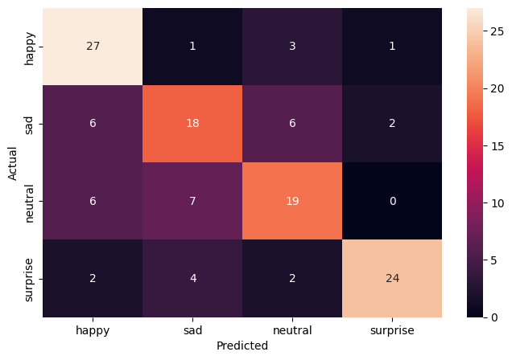

# 😀 Facial Emotion Recognition: CNNs and Transfer Learning for Grayscale vs RGB
This project explores facial emotion recognition using deep learning. Multiple convolutional neural network models were trained and evaluated on grayscale and RGB images to analyze the impact of color representation on model performance. The study further investigates transfer learning techniques to improve accuracy and generalization, with comprehensive evaluation using accuracy, loss, and confusion matrices.


## 📂 Table of Contents
- [Overview](#-overview)
- [Dataset](#-dataset)
- [Problem Statement](#-problem-statement)
- [Methodology](#-methodology)
- [Results](#-results)
- [Insights & Recommendations](#-insights--recommendations)
- [Technologies Used](#technologies-used)
- [How to Run](#how-to-run)

## 👓 Overview
This project implements a **deep learning pipeline** to **classify facial emotions (happy, sad, neutral, surprise)** from facial images using **Convolutional Neural Networks (CNNs)**. The models learn discriminative visual features from facial expressions, enabling accurate classification of previously unseen (unlabeled) images.

The pipeline includes:
- Data preprocessing and image handling (grayscale and RGB)
- Design and implementation of multiple CNN architectures
- Model training, evaluation, and performance comparison
- Transfer learning using a pre-trained **VGG16** model

## 📊 Dataset

The dataset for this project is sourced from the **MIT Applied Data Science Program** and is organized as follows:

- The dataset is provided in **ZIP format**, containing **training** and **test** folders.
- Each folder has **two subfolders**, each representing a **health condition of the cell**.
- All images are in **PNG format**.

> **Note:** The original dataset exceeds GitHub's upload limit.  
> To access the data, please contact me via my portfolio website:  
> [Contact Charles Jiao](https://charles-jiao.netlify.app/contact)

## ❓ Problem Statement
Classifying images is essential in computer vision, automation, and robotics, it remains challenging in fields such as public health where high accuracy makes great significance. In this project, I used the microscopic images to develop CNN-based classification models capable of accurately identifying blood cell images. The project produces a trained deep learning model along with a full training-evaluation pipeline that supports downstream prediction tasks.

## 💻 Methodology
The following steps outline the end-to-end process used in this project:

1. **Data (image) Processing**
   - **Data Retrieval and Preparation**: Extract data from the ZIP file and prepare the training and test data.
   - **Data Demonstration**: Randomly choose a few images and observe their potential features that may be extracted in CNN; demonstrate the class distribution.
   - **Data Preprocessing**: Label the data, split into training and test set, normalize the images, and encode the categories.

2. **Modelling**
   - Compare basic neural network and CNN models' performance applied in greyscale and RBG.
   - Build two transfer learning models for comparison.
   - The models include an initial base model, refined model with more neuron layers and augmented data.
   - For each model, build the architecture, training this model, and evaluate the model accuracy.

3. **Transfer Learning**
   - Build two transfer learning models (VGG16 and ResNet V2 models).
   - For each model, build the architecture, training this model, and evaluate the model accuracy.

4. **Final Model**
   - Apply the best model on the dataset.
   - Evaluate the model accuracy and confusion matrix.

## 📝 Results

The models were evaluated on the test set using **accuracy, loss, and confusion matrices**. Both grayscale and RGB images were compared across multiple CNN architectures and transfer learning approaches. A quick overview at different models' accuracy.

| Model / Technique           | Input Mode | Accuracy | Remarks                                               |
|-----------------------------|------------|---------|------------------------------------------------------|
| Base CNN (Model 1)          | Grayscale  | 0.68    | Simple, stable, performs better on grayscale        |
| Base CNN (Model 1)          | RGB        | 0.66    | Slightly worse, additional channels not useful      |
| Advanced CNN (Model 2)      | Grayscale  | 0.76    | Best performance among CNNs, suitable for grayscale|
| Advanced CNN (Model 2)      | RGB        | 0.30    | RGB caused significant drop; model overfits         |
| Complex CNN (Model 3)       | Grayscale  | 0.50    | Overly deep, moderate performance, potential overfitting |
| VGG16 Transfer Learning     | RGB        | 0.25    | Poor performance, pre-trained features not compatible |
| ResNet50 TL                 | RGB        | 0.25    | Similar to VGG16, unsuitable for small emotion dataset |
| EfficientNet TL             | RGB        | 0.25    | Small dataset and grayscale features not captured   |

- **Precision (1)**: When the model predicts a conversion, how often it is correct.  
- **Recall (1)**: Out of all actual conversions, how many were correctly identified.  
- **F1-Score (1)**: Balance between precision and recall.  
- **Accuracy**: Overall correct predictions (can be misleading if classes are imbalanced).  

**Classification Report**

| Class | Precision | Recall | F1-Score | Support |
|-------|----------|--------|----------|----------|
| 0     | 0.99     | 0.73   | 0.84     | 1300     |
| 1     | 0.78     | 0.99   | 0.87     | 1300     |

**Macro Avg:** Precision: 0.88, Recall: 0.86, F1-Score: 0.86
**Weighted Avg:** Precision: 0.88, Recall: 0.86, F1-Score: 0.86

**Confusion Matrix/ Heatmap**


## 💡 Insights & Recommendations

### Insights
- The CNN model achieved an overall accuracy of 86% on the test set.
- The model demonstrated high sensitivity for parasitized cells, correctly identifying 99% of malaria-infected images.
- The main source of error was the misclassification of uninfected cells as parasitized, accounting for 27% of uninfected images.
- Data visualization and analysis showed that the dataset is balanced, and normalization significantly helped in stabilizing the training process.
- Using transfer learning with VGG16 improved feature extraction and reduced training time compared to training a CNN from scratch.

### Implications
- The model can assist medical practitioners in automated screening of malaria, potentially reducing human error and speeding up diagnosis.
- High sensitivity to parasitized cells ensures that infected cases are rarely missed, which is critical for early treatment.
- Misclassification of uninfected cells indicates that further improvements are needed to reduce false positives, possibly through more advanced architectures or larger, higher-quality datasets.

### Future Work
- Explore more sophisticated CNN architectures and ensemble methods to improve classification accuracy.
- Implement additional preprocessing techniques, such as contrast enhancement or stain normalization, to improve image quality.
- Expand the dataset to include diverse cell images from different sources to enhance the model's robustness.
- Integrate the model into a real-time diagnostic system for clinical use.

<a id="technologies-used"></a>
## ⚙️ Technologies Used
- **Python** – General purpose programming
- **NumPy** – Numerical computations
- **Matplotlib & Seaborn** – Data and performance visualization
- **Scikit-learn** – Data preprocessing, model evaluation, and metrics
- **TensorFlow & Keras** – Building, training, and deploying Convolutional Neural Networks (CNN)
- **OpenCV** – Image processing and augmentation

<a id="how-to-run"></a>
## ▶️ How to Run
```bash
# Clone the repository
git clone https://github.com/elescj/011-malaria.git
cd 011-malaria-lr

# (Optional) Create a virtual environment
python -m venv venv
source venv/bin/activate  # On Windows: venv\Scripts\activate

# Install dependencies
pip install -r requirements.txt

# Run the script
python main.py
```
