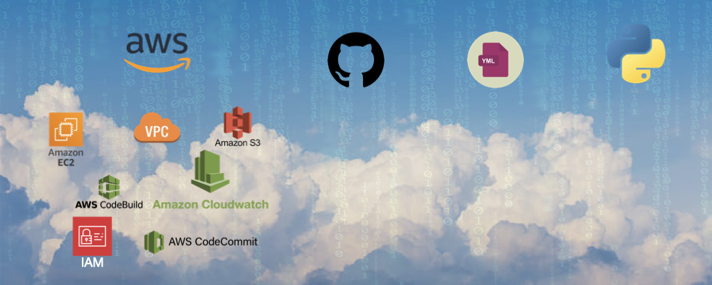
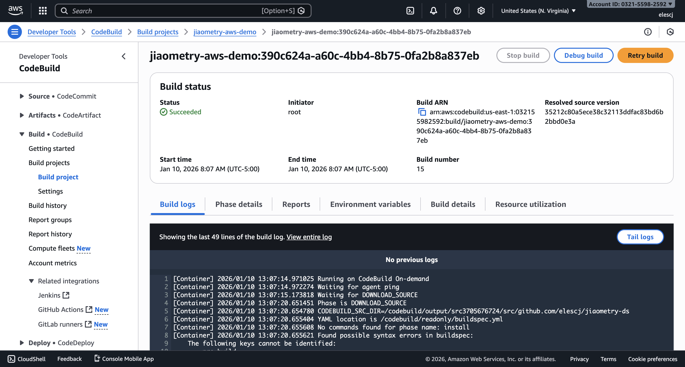

# ☁️ AWS Demo on Deployment and Cost Management
An end-to-end AWS demo showcasing CI/CD pipeline automation with CodeBuild and deployment monitoring with CloudWatch, with an emphasis on cost-aware resource management.

## 📂 Table of Contents
- [Overview](#-overview)
- [CI/CD Pipeline & Automated Deployment](#cicd-pipeline-automated-deployment)
  - [CI/CD Pipeline Walkthrough](#cicd-pipeline-walkthrough)
- [Cost Management](#-cost-management)
- [Summary](#-summary)

## 🧠 Overview
This project demonstrates an end-to-end AWS deployment workflow, combining CI/CD automation, infrastructure deployment, system monitoring, and cost-aware cloud management.

A Python application is built and tested through a GitHub-triggered AWS CodeBuild pipeline, then deployed to an EC2 instance running inside a custom VPC and subnet. Amazon CloudWatch is used to collect metrics and logs, and alarms are configured to detect threshold breaches. A workload-generating Python script is executed to validate monitoring and alerting behavior. All AWS resources are cleaned up after validation to ensure zero ongoing cost.

Key highlights:
- Automated CI/CD pipeline using GitHub webhooks and AWS CodeBuild
- Custom VPC, subnet, routing, and security groups for EC2 deployment
- CloudWatch metrics, logs, and alarms for observability and alerting
- Workload generation to validate monitoring and alarm triggers
- Cost-conscious teardown of all AWS resources after testing

## 🔁 CI/CD Pipeline & Automated Deployment

### 🛠️ CI/CD Pipeline Walkthrough

This project demonstrates a Python application integrated with an AWS CodeBuild CI pipeline. The focus is on build automation, GitHub integration, and cost-aware cloud usage.

This CI/CD pipeline automatically builds and tests a Python application whenever changes are pushed to GitHub, using AWS CodeBuild for isolated, reproducible builds.

### Step 1: Source Control & Trigger
The source code is hosted on GitHub. A webhook triggers AWS CodeBuild whenever changes are pushed to the main branch.

### Step 2: Build Environment Setup
AWS CodeBuild provisions an ephemeral Linux build environment using a managed image with Python preinstalled. This ensures consistent builds across runs.

### Step 3: Build Specification (buildspec.yml)
The pipeline behavior is defined in buildspec.yml, which specifies install, build, and test phases. Dependencies are installed, and application tests are executed automatically.
([View buildspec.yml](buildspec.yml))

### Step 4: Build Execution & Logs
During execution, CodeBuild streams logs to CloudWatch, providing visibility into each phase of the pipeline and enabling rapid debugging.

#### Build history

#### Build details

### Step 5: Artifacts & Output
Build artifacts are temporarily stored in S3 for validation purposes. No persistent storage is retained after pipeline validation.

### Step 6: Cost Management & Cleanup
After validating the pipeline, all AWS resources (CodeBuild project, S3 bucket, IAM role) were deleted to ensure zero ongoing cost. This repository preserves the full configuration for reproducibility.

## 🚨 Cost Management
Cost ManagementAll AWS resources (CodeBuild projects, S3 artifacts, IAM roles) were deleted after validation to ensure zero ongoing cost. This repository contains the full configuration to reproduce the pipeline.

Observed alarm in INSUFFICIENT_DATA state. Verified metric availability, monitoring resolution, alarm period alignment, and sustained CPU load. After sufficient datapoints were published, alarm transitioned to OK and then ALARM as expected.

## 💡 Summary
