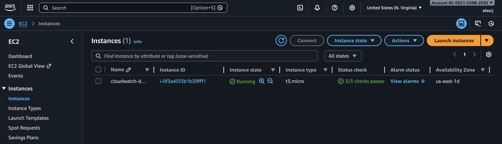
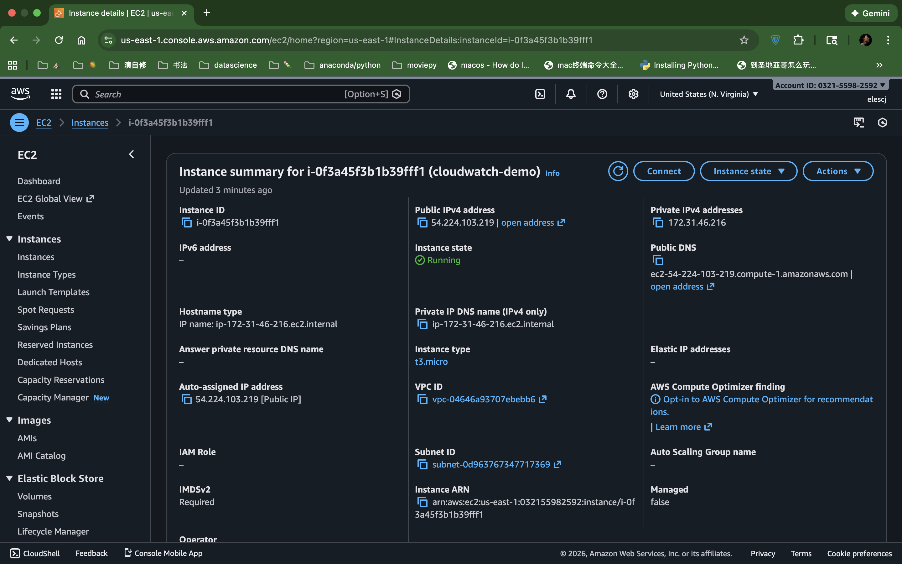
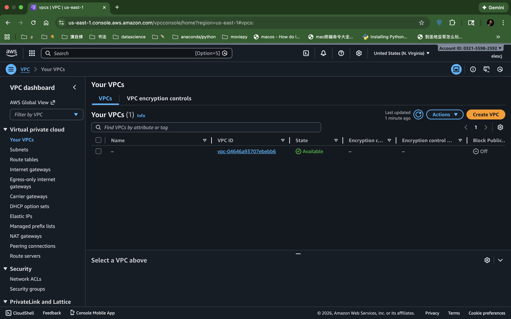
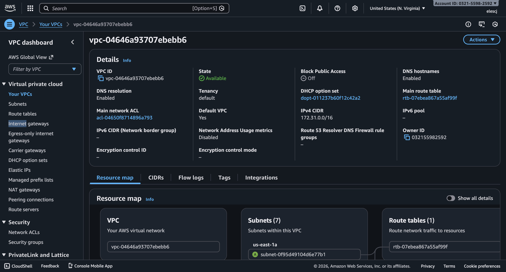
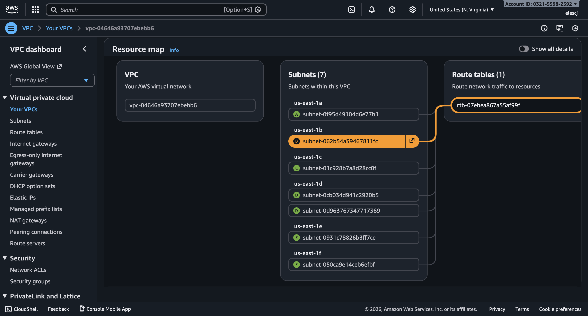
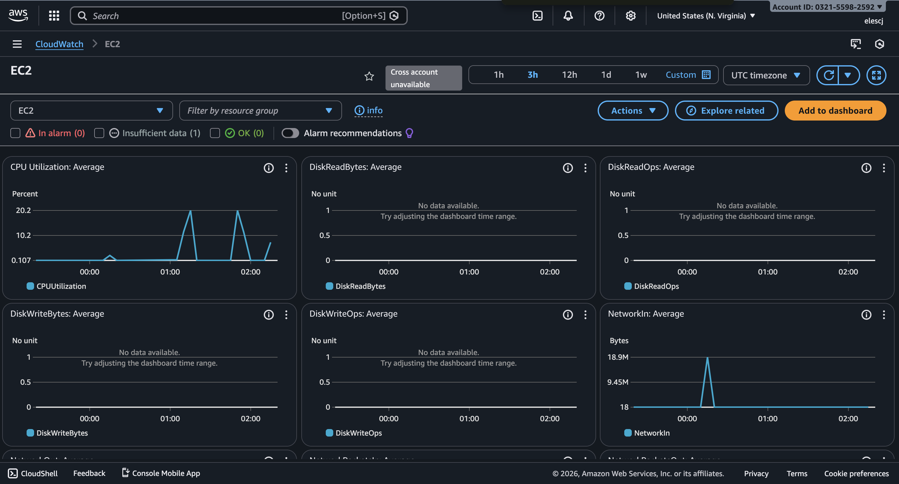
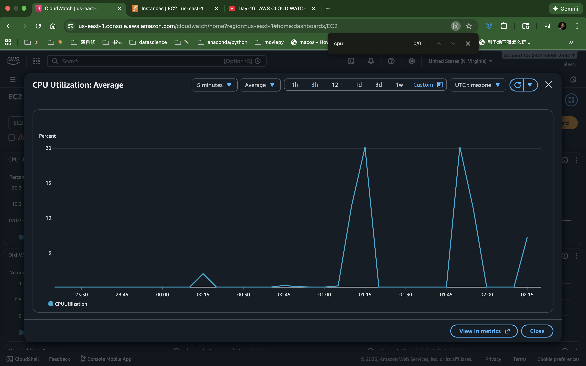
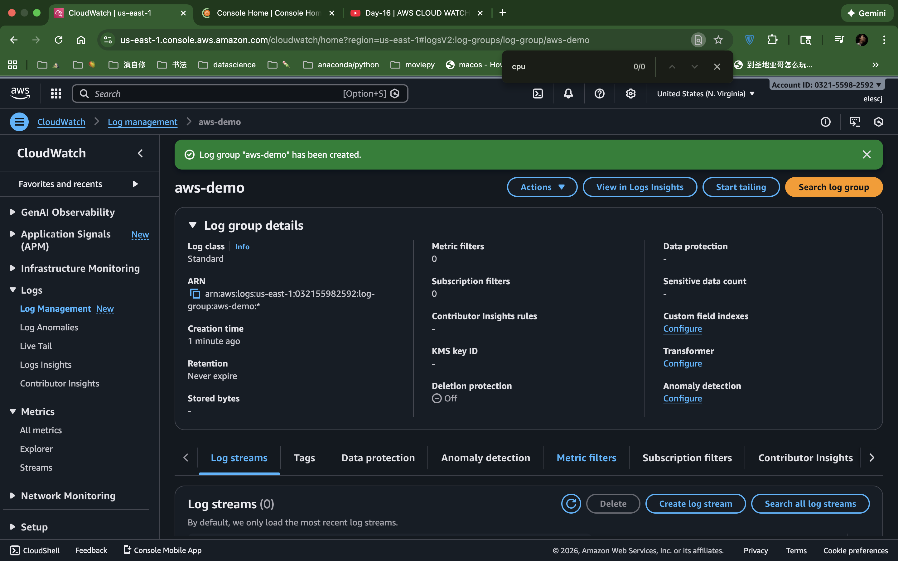
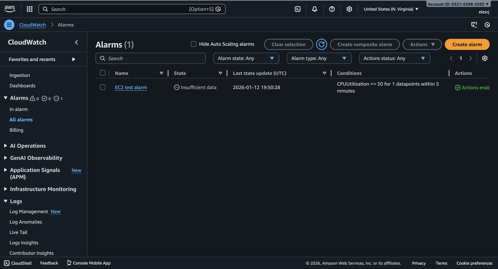
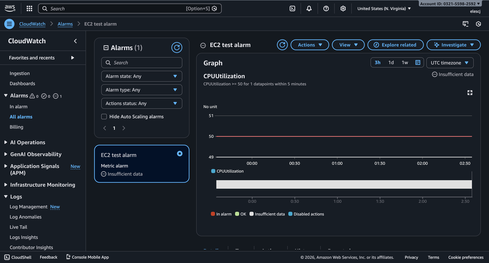

# ☁️ AWS Demo on Deployment and Cost Management
An end-to-end AWS demo showcasing CI/CD pipeline automation with CodeBuild and deployment monitoring with CloudWatch, with an emphasis on cost-aware resource management.

## 📂 Table of Contents
- [Overview](#-overview)
- [CI/CD Pipeline & Automated Deployment](#cicd-pipeline-automated-deployment)
  - [Build Setup](#build-setup)
  - [Artifacts & Output](#artifacts--output)
- [Cost Management](#-cost-management)
  - [EC2 Instance Deployment](#ec2-instance-deployment)
  - [Custom VPC & Networking Configuration](#custom-vpc--networking-configuration)
  - [CloudWatch Metrics Collection](#cloudwatch-metrics-collection)
  - [CloudWatch Logs](#cloudwatch-logs)
  - [CloudWatch Alarms & Alert Validation](#cloudwatch-alarms--alert-validation)
  - [Cost Management & Resource Cleanup](#cost-management--resource-cleanup)
- [Summary](#-summary)

## 🧠 Overview
This project demonstrates an end-to-end AWS deployment workflow, combining CI/CD automation, infrastructure deployment, system monitoring, and cost-aware cloud management.

A Python application is built and tested through a GitHub-triggered AWS CodeBuild pipeline, then deployed to an EC2 instance running inside a custom VPC and subnet. Amazon CloudWatch is used to collect metrics and logs, and alarms are configured to detect threshold breaches. A workload-generating Python script is executed to validate monitoring and alerting behavior. All AWS resources are cleaned up after validation to ensure zero ongoing cost.

Key highlights:

- Automated CI/CD pipeline using GitHub webhooks and AWS CodeBuild
- Custom VPC, subnet, routing, and security groups for EC2 deployment
- CloudWatch metrics, logs, and alarms for observability and alerting
- Workload generation to validate monitoring and alarm triggers
- Cost-conscious teardown of all AWS resources after testing

## 🔁 CI/CD Pipeline & Automated Deployment

This section demonstrates an end-to-end CI/CD pipeline for a Python application using GitHub and AWS CodeBuild. Changes pushed to the GitHub repository automatically trigger builds, which include dependency installation, running tests, and artifact creation. This workflow ensures reproducible, automated builds and provides full visibility into the build process.

Key highlights of this CI/CD pipeline include:
- Automated build and test process triggered via **GitHub webhooks**
- Use of **AWS CodeBuild** for isolated, consistent build environments
- **Buildspec.yml** defines install, build, and test phases
- **CloudWatch logs** provide detailed visibility into pipeline execution
- Temporary storage of artifacts in S3, ensuring zero persistent cost
The workflow follows a standard pattern: GitHub push → CodeBuild triggers → build and test → logs streamed to CloudWatch → artifacts temporarily stored in S3.

### Build Setup

This project demonstrates a Python application integrated with an AWS CodeBuild CI pipeline. The focus is on build automation, GitHub integration, and cost-aware cloud usage.

This CI/CD pipeline automatically builds and tests a Python application whenever changes are pushed to GitHub, using AWS CodeBuild for isolated, reproducible builds.

**Step 1: Source Control & Trigger**
The source code for this Python application is hosted in a GitHub repository, which serves as the single source of truth for the project. A GitHub webhook is configured to automatically trigger an AWS CodeBuild project whenever changes are pushed to the main branch. This ensures that every commit is automatically built, tested, and validated without manual intervention.

**Step 2: Build Environment Setup**
AWS CodeBuild provisions an ephemeral Linux build environment using a managed image with Python preinstalled. This ensures consistent builds across runs.

**Step 3: Build Specification (buildspec.yml)**
The pipeline behavior is defined in buildspec.yml, which specifies install, build, and test phases. Dependencies are installed, and application tests are executed automatically.
([View buildspec.yml](buildspec.yml))

**Step 4: Build Execution & Logs**
During execution, CodeBuild streams logs to CloudWatch, providing visibility into each phase of the pipeline and enabling rapid debugging.

- **Build history**
  

- **Build #1 details**
  
  **Build #2 details**
  

**Step 5: Artifacts & Output**
Build artifacts are temporarily stored in S3 for validation purposes. No persistent storage is retained after pipeline validation.

**Step 6: Cost Management & Cleanup**
After validating the pipeline, all AWS resources (CodeBuild project, S3 bucket, IAM role) were deleted to ensure zero ongoing cost. This repository preserves the full configuration for reproducibility.

### Artifacts & Output

During each successful build, AWS CodeBuild generates build artifacts that represent the validated output of the pipeline. These artifacts are temporarily stored in an Amazon S3 bucket to verify build correctness and pipeline integrity.

The artifacts are used solely for validation and inspection purposes and are not deployed to a long-running production environment. After confirming successful execution, the artifacts and associated storage resources are removed to prevent ongoing costs.

## 🚨 Cost Management
This section demonstrates system observability and cost-aware monitoring using Amazon CloudWatch. An EC2 instance is deployed inside a custom VPC, application metrics and logs are collected, and alarms are configured to validate automated alerting behavior under load.

### EC2 Instance Deployment

A Python application is deployed to an EC2 instance running inside a custom VPC and subnet. The instance serves as the workload target for monitoring and alert validation.

**EC2 Instance**

**EC2 Instance Details**

### Custom VPC & Networking Configuration

A dedicated VPC and subnet are created to isolate the EC2 instance. Routing, security groups, and internet access are explicitly configured to support application execution and monitoring.

**VPC**

**VPC Details**

**VPC Subnets**

### CloudWatch Metrics Collection

Amazon CloudWatch is used to collect EC2 performance metrics, including CPU utilization. Metrics are visualized in near real time while the application workload is running.

A workload-generating Python script is executed to intentionally increase CPU usage and validate metric collection behavior.

**CloudWatch Metrics Overview**

**CloudWatch Metrics Example: CPU Utilization**

### CloudWatch Logs

Application logs are streamed to CloudWatch Logs, enabling centralized visibility into runtime behavior without directly accessing the EC2 instance.

**CloudWatch Log**

### CloudWatch Alarms & Alert Validation

A CloudWatch alarm is configured to monitor CPU utilization and trigger when a defined threshold is exceeded. During workload execution, the alarm transitions to the ALARM state, confirming correct configuration and end-to-end monitoring.

**CloudWatch Alarm**

**CloudWatch Alarm Details**

### Cost Management & Resource Cleanup

After validating metrics, logs, and alarms, all AWS resources are deleted, including the EC2 instance, VPC components, CloudWatch alarms, and log groups. This ensures zero ongoing cost while preserving the configuration and documentation for reproducibility.

## 💡 Summary

This project demonstrates an end-to-end AWS workflow combining CI/CD automation, infrastructure deployment, system monitoring, and cost-conscious cloud management. A Python application is built and tested through a GitHub-triggered AWS CodeBuild pipeline, deployed to an EC2 instance within a custom VPC, and monitored using Amazon CloudWatch metrics, logs, and alarms. Controlled workload generation is used to validate observability and alerting behavior. All resources are cleaned up after validation to ensure zero ongoing cost, reflecting production-minded cloud engineering practices.
